# GitDiagram architecture — @konitif/viewer-3d

This architecture view was generated from the public repository by [GitDiagram](https://gitdiagram.com/lemouf/konitif-viewer-3d) on 2026-09-20 19:02:34 UTC.

It is a documentation projection of the repository tree, README, and source files sampled by GitDiagram. It does not replace the authored contracts in [catalog.json](catalog.json) and [diagrams.json](diagrams.json), nor does it establish runtime authority.

The Mermaid source keeps GitDiagram's groups, nodes, relationships, and source links. GitDiagram's forced color classes and HTML line breaks are omitted so the diagram remains readable in local previews and dark themes.

- Public repository: [konitif-viewer-3d](https://github.com/LeMouf/konitif-viewer-3d)
- Interactive diagram: [Open in GitDiagram](https://gitdiagram.com/lemouf/konitif-viewer-3d)

## Architecture diagram

```mermaid
flowchart TD

subgraph group_contracts["Public Contracts"]
  node_scene_api["Scene API — [index.ts]"]
  node_viewer_contract["Viewer Contract"]
  node_scene_snapshot["Scene Snapshot — [index.ts]"]
  node_model_definitions["Model Definitions"]
end

subgraph group_projection["Projection Math"]
  node_led_calibration["LED Calibration"]
  node_orientation_projection["Orientation Projection"]
  node_visual_ground["Visual Ground"]
end

subgraph group_runtime["Renderer Runtime"]
  node_renderer_entry["Renderer Entry — [index.ts]"]
  node_renderer_core["3D Renderer"]
  node_camera_controller["Camera Controller"]
  node_temporal_presentation["Temporal Presentation"]
end

subgraph group_interaction["Observation Interaction"]
  node_physics_adapter["Physics Mapping"]
  node_joint_resolution["Joint Resolution"]
  node_grounding_projection["Observed Grounding"]
  node_selection_controller["Selection Controller"]
  node_projectile_interaction["Projectile Interaction"]
  node_performance_diagnostics["Performance Diagnostics"]
end

node_viewer_host(("Viewer Host"))
node_observation_provider(("Observation Provider"))
node_simulation_provider(("Simulation Provider"))
node_threejs["Three.js"]

node_viewer_host -->|"creates scene"| node_scene_api
node_scene_api -->|"creates snapshot"| node_viewer_contract
node_scene_api -->|"returns snapshot"| node_scene_snapshot
node_viewer_host -->|"imports runtime"| node_renderer_entry
node_renderer_entry -->|"exports renderer"| node_renderer_core
node_simulation_provider -->|"provides simulation"| node_renderer_core
node_observation_provider -->|"provides observations"| node_renderer_core
node_renderer_core -->|"renders scene"| node_threejs
node_renderer_core -->|"controls camera"| node_camera_controller
node_camera_controller -->|"updates camera"| node_threejs
node_renderer_core -->|"projects motion"| node_temporal_presentation
node_observation_provider -->|"supplies contacts"| node_grounding_projection
node_grounding_projection -->|"projects grounding"| node_renderer_core
node_simulation_provider -->|"supplies joint values"| node_physics_adapter
node_physics_adapter -->|"resolves joints"| node_joint_resolution
node_joint_resolution -->|"maps pose"| node_renderer_core
node_renderer_core -->|"dispatches selection"| node_selection_controller
node_renderer_core -->|"dispatches projectiles"| node_projectile_interaction
node_renderer_core -->|"reports performance"| node_performance_diagnostics
node_camera_controller -.->|"provides quaternion"| node_orientation_projection
node_renderer_core -.->|"uses ground config"| node_visual_ground
node_renderer_core -.->|"uses LED calibration"| node_led_calibration
node_renderer_core -->|"uses model metadata"| node_model_definitions

click node_scene_api "https://github.com/lemouf/konitif-viewer-3d/blob/main/src/index.ts"
click node_scene_snapshot "https://github.com/lemouf/konitif-viewer-3d/blob/main/src/index.ts"
click node_model_definitions "https://github.com/lemouf/konitif-viewer-3d/blob/main/src/jointHandleDefinition.ts"
click node_led_calibration "https://github.com/lemouf/konitif-viewer-3d/blob/main/src/ledRingCalibration.ts"
click node_orientation_projection "https://github.com/lemouf/konitif-viewer-3d/blob/main/src/orientationGizmoProjection.ts"
click node_visual_ground "https://github.com/lemouf/konitif-viewer-3d/blob/main/src/visualGroundConfig.ts"
click node_renderer_entry "https://github.com/lemouf/konitif-viewer-3d/blob/main/src/renderer/index.ts"
click node_renderer_core "https://github.com/lemouf/konitif-viewer-3d/blob/main/src/renderer/Viewer3DRenderer.ts"
click node_camera_controller "https://github.com/lemouf/konitif-viewer-3d/blob/main/src/renderer/CameraController.ts"
click node_temporal_presentation "https://github.com/lemouf/konitif-viewer-3d/blob/main/src/renderer/TemporalProjectionModel.ts"
click node_physics_adapter "https://github.com/lemouf/konitif-viewer-3d/blob/main/src/renderer/physics/ViewerPhysicsJointMapping.ts"
click node_joint_resolution "https://github.com/lemouf/konitif-viewer-3d/blob/main/src/renderer/physics/ViewerJointResolution.ts"
click node_grounding_projection "https://github.com/lemouf/konitif-viewer-3d/blob/main/src/renderer/ObservedRobotGroundingProjection.ts"
click node_selection_controller "https://github.com/lemouf/konitif-viewer-3d/blob/main/src/renderer/SelectionController.ts"
click node_projectile_interaction "https://github.com/lemouf/konitif-viewer-3d/blob/main/src/renderer/ProjectileInteraction.ts"
click node_performance_diagnostics "https://github.com/lemouf/konitif-viewer-3d/blob/main/src/renderer/PerformanceMonitor.ts"

```

## Generated analysis

@konitif/viewer-3d is a Three.js spatial-projection library. A host creates a 3D scene snapshot through the public contract API, then optionally drives the explicit-provider renderer with simulation and observation inputs. The renderer presents robot poses, camera views, grounding, temporal transitions, selection, and projectile interaction. Pure submodules separately provide orientation projection, visual-ground normalization, authored model definitions, LED calibration, and physics-joint compatibility. The sampled files show contracts and several projection stages; some renderer orchestration links remain intentionally conservative.
